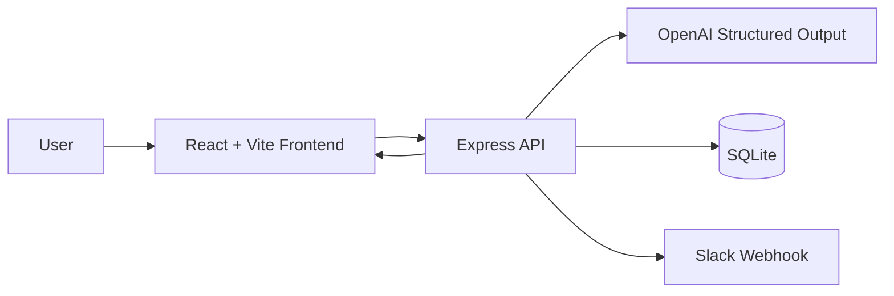

# Groovy Meeting Summary Agent

Groovy Meeting Summary Agent is a production-oriented internal web app that turns raw meeting transcripts into structured summaries, action items, decisions, deadlines, and Slack-ready updates.

It solves a practical operations problem: teams lose time rewriting notes, hunting for action items, and manually posting follow-ups. This app centralizes the workflow in one place.

## What it does

- Accepts meeting transcripts or notes
- Uses an LLM to produce structured summaries
- Extracts key discussion points, decisions, action items, owners, deadlines, and blockers
- Saves each meeting to SQLite for later retrieval
- Sends summaries or action items to Slack via webhook
- Answers questions like “What decisions were made in the last API architecture meeting?”

## Architecture



## Tech Stack

- Frontend: React, TypeScript, Vite, CSS
- Backend: Node.js, Express, TypeScript
- LLM: OpenAI
- Database: SQLite
- Notifications: Slack Incoming Webhooks

## Setup

### 1. Install dependencies

```bash
cd meeting-summary-agent
npm install
```

### 2. Configure environment variables

Copy `backend/.env.example` to `backend/.env` and fill in your values.

### 3. Start the app

```bash
npm run dev
```

Frontend: http://localhost:5173

Backend: http://localhost:3001

## Environment Variables

| Variable | Required | Description |
|---|---:|---|
| `OPENAI_API_KEY` | Yes | OpenAI API key |
| `OPENAI_MODEL` | No | Defaults to `gpt-4.1-mini` |
| `SLACK_WEBHOOK_URL` | No | Slack incoming webhook URL |
| `PORT` | No | Backend port, defaults to `3001` |
| `DATABASE_PATH` | No | SQLite file path |
| `CORS_ORIGIN` | No | Allowed frontend origin |

## Database Schema

### meetings

- `id`
- `title`
- `meeting_date_time`
- `participants_json`
- `transcript`
- `summary`
- `key_points_json`
- `decisions_json`
- `risks_json`
- `status`
- `created_at`
- `updated_at`

### action_items

- `id`
- `meeting_id`
- `task`
- `owner`
- `deadline`
- `status`
- `created_at`

## Example Prompts

- “Summarize this transcript and save it.”
- “Send today’s action items to Slack.”
- “What decisions were made in the last API architecture meeting?”
- “Show me action items from yesterday’s engineering meeting.”

## Demo Flow

1. Paste a transcript.
2. Click Analyze and Save.
3. Review the structured summary and action items.
4. Send the action items to Slack.
5. Ask a follow-up question to retrieve a previous meeting.

## Notes

- The app never invents details that are not present in the transcript.
- Missing owners or deadlines are surfaced explicitly as `Unassigned` or `Missing`.
- Cost telemetry is logged on every LLM request.
# Groovy Meeting Summary Agent

Groovy Meeting Summary Agent is a production-oriented internal web app that turns raw meeting transcripts into structured summaries, action items, decisions, deadlines, and Slack-ready updates.

It solves a practical operations problem: teams lose time rewriting notes, hunting for action items, and manually posting follow-ups. This app centralizes the workflow in one place.

## What it does

- Accepts meeting transcripts or notes
- Uses an LLM to produce structured summaries
- Extracts key discussion points, decisions, action items, owners, deadlines, and blockers
- Saves each meeting to SQLite for later retrieval
- Sends summaries or action items to Slack via webhook
- Answers questions like “What decisions were made in the last API architecture meeting?”

## Architecture


## Tech Stack

- Frontend: React, TypeScript, Vite, CSS
- Backend: Node.js, Express, TypeScript
- LLM: OpenAI
- Database: SQLite
- Notifications: Slack Incoming Webhooks

## Setup

### 1. Install dependencies

```bash
cd meeting-summary-agent
npm install
```

### 2. Configure environment variables

Copy `backend/.env.example` to `backend/.env` and fill in your values.

### 3. Start the app

```bash
npm run dev
```

Frontend: http://localhost:5173

Backend: http://localhost:3001

## Environment Variables

| Variable | Required | Description |
|---|---:|---|
| `OPENAI_API_KEY` | Yes | OpenAI API key |
| `OPENAI_MODEL` | No | Defaults to `gpt-4.1-mini` |
| `SLACK_WEBHOOK_URL` | No | Slack incoming webhook URL |
| `PORT` | No | Backend port, defaults to `3001` |
| `DATABASE_PATH` | No | SQLite file path |
| `CORS_ORIGIN` | No | Allowed frontend origin |

## Database Schema

### meetings

- `id`
- `title`
- `meeting_date_time`
- `participants_json`
- `transcript`
- `summary`
- `key_points_json`
- `decisions_json`
- `risks_json`
- `status`
- `created_at`
- `updated_at`

### action_items

- `id`
- `meeting_id`
- `task`
- `owner`
- `deadline`
- `status`
- `created_at`

## Example Prompts

- “Summarize this transcript and save it.”
- “Send today’s action items to Slack.”
- “What decisions were made in the last API architecture meeting?”
- “Show me action items from yesterday’s engineering meeting.”

## Demo Flow

1. Paste a transcript.
2. Click Analyze and Save.
3. Review the structured summary and action items.
4. Send the action items to Slack.
5. Ask a follow-up question to retrieve a previous meeting.

## Notes

- The app never invents details that are not present in the transcript.
- Missing owners or deadlines are surfaced explicitly as `Unassigned` or `Missing`.
- Cost telemetry is logged on every LLM request.